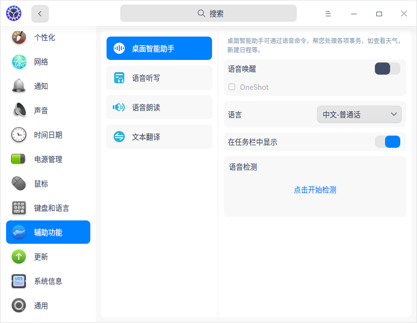

# 统信UOS提供哪些辅助功能

统信UOS提供了功能强大的辅助工具，包含桌面智能助手、语音听写、语音朗读、文本翻译等，协助您高效地进行各种操作。
在控制中心，点击 **辅助功能**，可对各功能进行基本设置。

> 说明：只有系统激活后，才可以使用语音听写、语音朗读、翻译及桌面智能助手相关功能。当首次启动桌面智能助手时，需要同意隐私协议，确定同意隐私协议后，才可以正常使用桌面智能助手及语音听写、语音朗读、翻译的功能。

## 桌面智能助手

桌面智能助手是系统内置的程序，支持语音和文字输入，查找信息、执行指令等功能。

通过桌面智能助手，您可以快捷地设置系统，如调节系统音量、屏幕亮度、开启/关闭WiFi或蓝牙等，还可以高效地处理各项事务，如查看天气，新建日程等。

### 唤醒智能助手

使用以下方法唤醒智能助手：
- 单击任务栏上的 ，打开桌面智能助手。
- 通过快捷键 Super + Q ，唤出助手对话框界面。
- 使用固定语“你好，小华”或“你好，小华+命令语”唤起桌面智能助手，唤出助手对话界面。

### 使用智能助手

文字/语音输入指令的操作步骤如下：

1. 唤醒桌面智能助手后，若已连接录音设备，可使用语音与智能助手直接对话，如更换壁纸、调节屏幕亮度，查询信息等。
2. 若未连接录音设备，等输入框出现后，还可以输入文字指令。

点击 **控制中心** > **辅助功能** > **桌面智能助手**，对其进行设置：
- 开启/关闭语音唤醒：当开启语音唤醒时，支持勾选OneShot，开启唤醒命令+语义命令唤起方式，例如：你好，小华！北京天气怎样？
- 设置语言：目前仅支持中文-普通话。
- 开启/关闭在任务栏中显示：开启在任务栏中显示，关闭则不在任务栏中显示，关闭后还可以使用快捷键唤起。
- 语音检测：检测语音输入状态是否正常。

## 语音听写

语音听写，将语音自动转换为文字。当您想把语音实时显示为文字时，可使用此功能。

1. 在文本输入框中，使用快捷键 **Ctrl** + **AIt** + **O** 唤起语音听写功能，或在右键菜单中选择“语音听写”。
2. 输入语音，文字将显示在界面上。

点击 **控制中心** > **辅助功能** > **语音听写**，对其进行设置：
- 当有音频输入设备时，语音听写默认为开启状态；当没有音频输入设备时，则默认为关闭状态。您也可以手动开启或关闭此功能。
- 语音听写可识别2种语言，支持设置为中文-普通话、英语。

## 语音朗读
语音朗读，仅朗读当前选中文本。操作步骤如下。

1.  选中文本，按下快捷键 **Ctrl** + **Alt** + **P** 或在右键菜单中选择 **语音朗读** ，开始朗读选中的文字。
2.  若要中断朗读，单击喇叭图标中止朗读，或右键单击 **停止朗读**。 

点击 **控制中心** > **辅助功能** > **语音朗读**，对其进行设置：

- 开启/关闭语音朗读：当有音频输出设备时，默认语音朗读为开启状态；当没有音频输出设备时，则默认为关闭状态；如无音频输出设备则隐藏此项 。

- 开启/关闭朗读控件显示：当为关闭状态时，不展示喇叭图标，但仍可以使用快捷键或在右键菜单中唤起。

- 音源：设置朗读声音为女声、男声或童声。

## 文本翻译

文本翻译，根据翻译语言设置，仅翻译当前选中文本。操作步骤如下。

1. 选中文本，按下快捷键 **Ctrl** + **AIt** + **U** 或在右键菜单中选择 **翻译**， 弹出翻译浮窗。 

> 说明：当前仅支持中英互译。

点击 **控制中心** > **辅助功能** > **语音朗读**，对其进行设置：

- 开启/关闭文本翻译：默认为开启状态。
- 语言：设置翻译语言，如中译英、英译中。