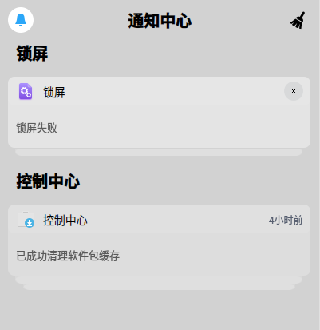
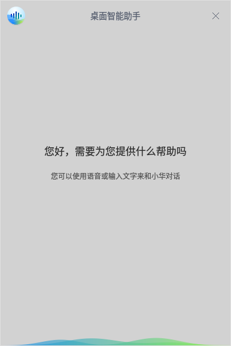
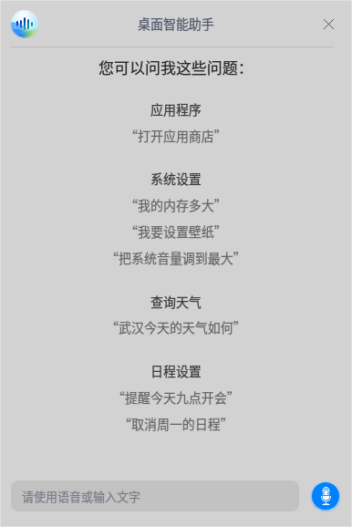

# 任务栏

任务栏是指位于桌面底部的长条，主要由启动器、应用程序图标、托盘区、系统插件等组成。在任务栏，您可以打开启动器、显示桌面、进入工作区，对其上的应用程序进行打开、新建、关闭、强制退出等操作，还可以设置输入法，调节音量，连接网络，查看日历，进入关机界面等。

## 认识任务栏图标
任务栏图标包括启动器图标、应用程序图标、托盘区图标、系统插件图标等。

| 图标                                                         | 说明                                                | 图标                                                    | 说明                                        |
| ------------------------------------------------------------ | :-------------------------------------------------- | ------------------------------------------------------- | ------------------------------------------- |
|                          | 启动器 - 点击查看所有已安装的应用。                 |  | 显示桌面。                                  |
|  | 多任务视图 - 点击显示工作区。                       |            | 文件管理器 - 点击查看磁盘中的文件、文件夹。 |
|                             | 浏览器 - 点击打开网页。                             |              | 商店 - 搜索安装应用软件。                   |
|                        | 相册 - 导入并管理照片。                             |                    | 音乐 - 播放本地音乐。                       |
|                   | 联系人 - 好友通讯，视频会议。                       |                    | 日历 - 查看日期、新建日程。                 |
|                       | 控制中心 - 点击进入系统设置。                       |                    | 通知中心 - 显示所有系统和应用的通知。       |
|         | 桌面智能助手 - 使用语音或文字来发布指令或进行询问。 |                              | 屏幕键盘 - 点击使用虚拟键盘。               |
|                          | 电源 - 点击进入关机界面。                           |                             | 回收站。                                    |

&nbsp;&nbsp;&nbsp;&nbsp;&nbsp;&nbsp;&nbsp;&nbsp;&nbsp;&nbsp;&nbsp;&nbsp;&nbsp;
> 窍门：在高效模式下，单击任务栏右侧可显示桌面。将鼠标指针移到任务栏上已打开窗口的图标时，会显示相应的预览窗口。

## 切换显示模式
任务栏提供两种显示模式：时尚模式和高效模式，显示不同的图标大小和应用窗口激活效果。

&nbsp;&nbsp;&nbsp;&nbsp;&nbsp;&nbsp;&nbsp;&nbsp;&nbsp;&nbsp;&nbsp;&nbsp;&nbsp;

您可以通过以下操作来切换显示模式：

1. 右键单击任务栏。
2. 在 **模式** 子菜单中选择一种显示模式。

## 设置任务栏位置
您可以将任务栏放置在桌面的任意方向。

1. 右键单击任务栏。
2. 在 **位置** 子菜单中选择一个方向。

## 调整任务栏高度 
鼠标拖动任务栏边缘，改变任务栏高度。

## 显示/隐藏任务栏
任务栏可以隐藏，以便最大程度的扩展桌面的可操作区域。

1. 右键单击任务栏。
2. 在 **状态** 子菜单中您可以：
  - 选择 **一直显示**，任务栏将会一直显示在桌面上。
  - 选择 **一直隐藏**，任务栏将会隐藏起来，只有在鼠标移至任务栏区域时才会显示。
  - 选择 **智能隐藏**，当占用任务栏区域时，任务栏自动隐藏。

> 说明：如果您使用的是触屏电脑，可以使用触屏手势代替鼠标操作：当任务栏设置为“智能隐藏”或“一直隐藏”时，如果任务栏在底部，在屏幕边缘从下往上划入，唤出任务栏；如果任务栏在顶部，在屏幕边缘从上往下划入，唤出任务栏。

## 显示/隐藏插件

1. 右键单击任务栏。
2. 在 **插件** 子菜单中勾选或取消勾选 **回收站、电源、显示桌面、屏幕键盘、通知中心、多任务视图、时间、桌面智能助手**，可以设置这些插件在任务栏上的显示和隐藏效果。

## 查看通知
当有系统或应用通知时，会在桌面上方弹出通知消息。若有按钮，单击按钮执行对应操作；若无按钮，单击关闭此消息。

&nbsp;&nbsp;&nbsp;&nbsp;&nbsp;&nbsp;&nbsp;&nbsp;&nbsp;&nbsp;&nbsp;&nbsp;&nbsp;

您还可以单击任务栏上的 ， 打开通知中心，查看所有通知。

> 说明：如果您使用的是触屏电脑，可以使用触屏手势代替鼠标操作：从屏幕右侧边缘划入超过任务栏高度，唤出通知中心。

## 使用智能助手

智能助手是系统预制的程序，它支持语音和文字输入，支持查找信息、操作指令等功能。

通过智能助手您可以调节系统声音的音量、屏幕亮度、还可以开启/关闭电源节能模式、WiFi或蓝牙。

> 说明：只有系统授权后，才可以使用语音听写、语音朗读、翻译及桌面智能助手相关功能。当首次启动桌面智能助手时，需要确定隐私协议，确定同意隐私协议后，可以正常使用桌面智能助手及语音听写、语音朗读、翻译等功能。

使用以下方法可以唤醒智能助手：

- 通过快捷键 **Super** + **q** ，唤出助手对话框界面。
- 支持固定语“你好，小华”或“你好，小华+命令语”唤起桌面智能助手，唤出助手对话界面。

使用智能助手文字输入、语音输入的操作步骤如下。

1. 单击任务栏上的 ， 打开桌面智能助手。
2. 连接录音设备后，使用语音与智能助手直接对话，如更换壁纸、调节屏幕亮度，查询信息等。
3. 等输入框出现后，还可以输入文字指令。

 

> 窍门：选中文字按下 **Ctrl** + **AIt** + **P** 可以进行语音播报；连接录音设备后，输入框内按下**Ctrl** + **AIt** + **O** 进入听写模式，把语音输入转换为文字。

### **设置语音听写**

在控制中心默认设置语音听写功能，默认是开启状态，可以设置关闭。

选中文本输入框后可通过快捷键唤起语音听写功能，开始听写输入文本。 

### 设置语音朗读

在控制中心默认设置语音朗读功能，只有开启了语音朗读功能后，才能唤起朗读。 

仅朗读当前选中文本，语音朗读的操作步骤如下 。

1.  选中文本， 在键盘上按下快捷键 **Ctrl** + **AIt** + **O** 或在右键菜单中选择 **语音朗读** ，单击后唤起朗读。
2. 如果需要中断朗读时， 可以单击图标喇叭中止朗读，也可以右键单击 **停止朗读**。 

> 说明：如在朗读中，再次选中其他文本，则朗读图标显示在最新选中文本的位置。单击图标或快捷键、右键菜单选择语音朗诵，打断正在朗读的文本转而朗读最新选中的文本。

### 设置翻译功能

在控制中心默认设置（开启）翻译功能，只有开启了翻译功能后，才可以唤起翻译功能。

仅翻译当前选中文本， 根据翻译设置语音翻译，翻译的操作步骤如下 。

1. 选中文本， 在键盘上按下快捷键 **Ctrl** + **AIt** + **U** 或在右键菜单中选择 **翻译**， 弹出翻译浮窗。 

> 说明：当前仅支持中英互译。

## 查看日期时间

- 鼠标指针悬停在任务栏的时间上，查看当前日期、星期和时间。
- 单击时间，打开日历。

## 进入关机界面
您可以单击任务栏上的  进入关机界面，也可以在启动器的小窗口模式中单击 。

| 功能                                                         | 说明                                                         |
| ------------------------------------------------------------ | ------------------------------------------------------------ |
| 关机              | 关闭电脑。                                                   |
| 重启                  | 关机后再次重新运行您的电脑。                                 |
| 待机                | 整个系统将处于低能耗运转的状态。                             |
| 休眠                      | 识别到有swap分区的机器休眠挂载到硬盘。没有swap分区不显示此项。 |
| 锁定                      | 锁定电脑，或按下键盘上的 **Super** + **L** 组合键锁定。      |
| 切换用户      | 选择另一个用户帐户登录。                                     |
| 注销                  | 清除当前登录用户的信息。                                     |
| 系统监视器 | 快速启动系统监视器。                                         |

&nbsp;&nbsp;&nbsp;&nbsp;&nbsp;&nbsp;&nbsp;&nbsp;&nbsp;&nbsp;&nbsp;&nbsp;&nbsp;

> 说明：当系统存在多个帐户时才显示 。

## 回收站
电脑中临时被删除的所有文件您都可以在回收站中找到，回收站中的文件可以被恢复或清空。

### 还原文件
对于已删除的文件，您可以进入回收站进行还原，或使用 **Ctrl** + **Z** 还原刚删除的文件。

1. 在回收站中，选择要恢复的文件。
2. 单击鼠标右键，选择 **还原**。
3. 还原文件到原来的存储路径下。

> 注意：如果原来所在的文件夹已经删除，还原文件时会自动新建文件夹。

### 清空回收站
在回收站中，单击 **清空**，将彻底删除回收站的所有内容。

