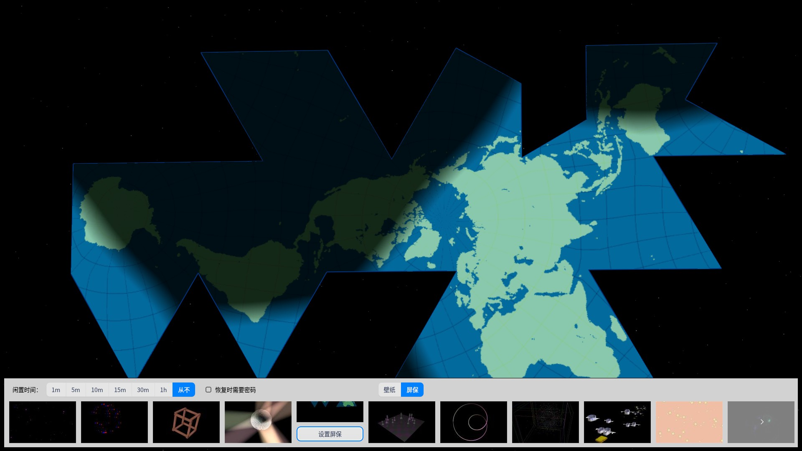

# 桌面

桌面是您登录后看到的主屏幕区域。在桌面上，您可以新建文件/文件夹、排列文件、打开终端、设置壁纸和屏保等，还可以通过 **发送到桌面** 向桌面添加应用的快捷方式。

> 说明：在触控板上（触控板支持多点触控），您可以使用手势代替鼠标操作：四指/五指向下移动显示桌面，紧接着向上移动隐藏桌面， 对应 **Super** + **D** 快捷键。

## 新建文件夹/文档

在桌面新建文件夹或文档，也可以对文件进行常规操作，和在文件管理器中一样。

- 在桌面上，单击鼠标右键，单击 **新建文件夹**，输入新建文件夹的名称。
- 在桌面上，单击鼠标右键，单击 **新建文档**，选择新建文档的类型，输入新建文档的名称。

在桌面文件或文件夹上，单击鼠标右键，您可以使用文件管理器的相关功能：

| 功能           | 说明                                                      |
| -------------- | --------------------------------------------------------- |
| 打开方式       | 选定系统默认打开方式，也可以选择其他关联应用程序来打开。  |
| 剪切           | 移动文件或文件夹。                                        |
| 复制           | 复制文件或文件夹。                                        |
| 重命名         | 重命名文件或文件夹。                                      |
| 删除           | 删除文件或文件夹。                                        |
| 创建链接       | 创建一个快捷方式。                                        |
| 添加至光盘刻录 | 插入光驱后，显示刻录，将数据刻录到光盘、CD或DVD等介质中。 |
| 标记信息       | 添加标记信息，以对文件或文件夹进行标签化管理。            |
| 压缩/解压缩    | 压缩文件或文件夹，或对压缩文件进行解压。                  |
| 病毒查杀       | 对文件或文件夹进行病毒查杀。                              |
| 属性           | 查看文件或文件夹的基本信息，共享方式，及其权限。          |

> 说明：
> - 如果您使用的是触屏电脑，可以使用触屏手势代替鼠标操作：在触摸屏上，长按1秒再抬起即打开当前对象的右键菜单。
> - 在触控板上（触控板支持多点触控），您可以使用手势代替鼠标操作：二指单击，显示右键菜单。
> - 在键盘上按下 **Ctrl** + **M** 快捷键，打开右键菜单。

## 设置排列方式
您可以对桌面上的图标按照需要进行排序。

1. 在桌面上，单击鼠标右键。
2. 单击 **排序方式**，您可以：
  - 单击 **名称**，将按文件的名称顺序显示。
  - 单击 **大小**，将按文件的大小顺序显示。
  - 单击 **类型**，将按文件的类型顺序显示。
  - 单击 **修改时间**，文件将按最近一次的修改日期顺序显示。

> 窍门：您也可以勾选 **自动排列**，桌面图标将从上往下，从左往右按照当前排序规则排列，有图标被删除时后面的图标会自动向前填充。

## 调整图标大小
1. 在桌面上，单击鼠标右键。
2. 单击 **图标大小**。
3. 选择一个合适的图标大小。

> 窍门：您也可以用 **Ctrl** + //鼠标滚动来调整桌面和启动器中的图标大小。

## 设置显示器
从这里快速进入控制中心设置显示器的缩放比例、分辨率和亮度等。

1. 在桌面上，单击鼠标右键。
2. 单击 **显示设置**，快速进入控制中心的显示设置界面。

 ## 更改壁纸
您可以选择一些精美、时尚的壁纸来美化桌面，让您的电脑显示与众不同。

1. 在桌面上，单击鼠标右键。
2. 单击 **壁纸与屏保**，在桌面底部预览所有壁纸。
3. 选择某一壁纸后，壁纸就会在桌面和锁屏中生效。
4. 您可以单击 **仅设置桌面** 和 **仅设置锁屏** 来控制壁纸的生效范围。

&nbsp;&nbsp;&nbsp;&nbsp;&nbsp;&nbsp;&nbsp;&nbsp;&nbsp;&nbsp;&nbsp;&nbsp;&nbsp;
> 窍门：
> - 勾选 **自动更换壁纸**，设置自动更换壁纸的时间间隔。您还可以设置在“登录时”和“唤醒时”自动更换壁纸。
> -  您还可以在图片查看器中设置您喜欢的图片为桌面壁纸。

## 设置屏保
屏幕保护程序原本是为了保护显像管，现在一般用来防范他人偷窥您电脑上的一些隐私。

1. 在桌面上，单击鼠标右键。
2. 单击 **壁纸与屏保**，单击 **屏保**，在桌面底部预览所有屏保。
3. 选择其中一个屏保，单击 **设置屏保**，在上方选择 **闲置时间**。
4. 您可以勾选 **恢复时需要密码**，以便更好地保护您的隐私。
5. 待电脑空闲指定时间后，将启动您选择的屏幕保护程序。

## 剪贴板
剪贴板展示当前用户登录系统后复制和剪切的所有文本、图片和文件。使用剪贴板可以快速复制其中的某项内容。注销或关机后，剪贴板会自动清空。

1. 使用快捷键 **Ctrl** + **Alt** + **V** 唤出剪贴板。
2. 双击剪贴板内的某一区块，会快速复制当前内容， 且当前区块会被移动到剪贴板顶部。
3. 选择目标位置粘贴。
4. 鼠标移入剪贴板的某一区块，单击上方的，删除当前内容；单击顶部的 **全部清除**，清空剪贴板。

> 说明：如果您使用的是触屏电脑，可以使用触屏手势代替鼠标操作：从屏幕左侧边缘划入超过任务栏高度，唤出剪贴板。

