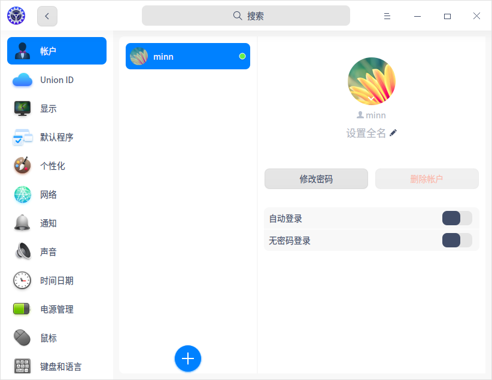

# 在计算机中添加新用户

安装系统时您已经创建了一个帐户。您还可以为使用此电脑的其他人创建一个本地用户帐户，方便他人自定义系统和管理他的文件。

#### 创建新帐户

1. 在控制中心首页，单击 。
2. 单击 **创建帐户**。
3. 输入用户名、密码和重复密码。
4. 单击 **创建**。
5. 在授权对话框输入当前帐户的密码，新帐户就会添加到帐户列表中。

#### 更改头像

1. 在控制中心首页，单击 。
2. 单击列表中的帐户。
3. 单击帐户头像，选择一个头像或添加本地头像，头像就替换完成了。

#### 设置全名

帐户全名会显示在帐户列表和系统登录界面，可根据需要设置。

1. 在控制中心首页，单击 。
2. 单击列表中的帐户。
3. 单击 **设置全名** 后的 ，输入帐户全名。

#### 修改密码

1. 在控制中心首页，单击 。
2. 单击当前帐户。
3. 单击 **修改密码**，进入修改密码页面。
4. 输入当前密码、新密码和重复密码。

> 注意: 请记住您的密码，如果您忘记密码或丢失密码，将无法为您恢复。

#### 自动登录

开启“自动登录”后， 下次启动系统时（重启、开机）可直接进入桌面。在锁屏和注销后再次登录需要密码。

1. 在控制中心首页，单击。
2. 单击当前帐户。
3. 打开 **自动登录** 开关，开启自动登录功能。

#### 无密码登录

开启“无密码登录”后，下次登录系统时（重启，开机，和在注销后再次登录），不需要密码，单击  即可登录系统。

1. 在控制中心首页，单击。
2. 单击当前帐户。
3. 打开 **无密码登录** 开关，开启后可以不用输入密码登录系统。

> 窍门： 
>
> - 若“无密码登录”和“自动登录”同时打开，下次启动系统（重启、开机）则直接进入桌面。
> - 默认勾选“清空钥匙环密码”，在无密码登录情况下登录已经记录密码的程序时不需要再次输入系统登录密码，反之则每次都需要输入系统登录密码。

#### 设置指纹密码

指纹密码可以用来登录系统、解锁屏幕、特殊操作授权。当需要输入帐户密码时，请扫描您的指纹。

1. 在控制中心首页，单击 。
2. 单击当前帐户。
3. 单击 **添加指纹** 。
4. 使用指纹设备录入指纹。
5. 待指纹添加成功之后单击 **完成**。

> 说明：您可以添加多个指纹密码；也可以一个个删除指纹密码。

#### 删除帐户

1. 在控制中心首页，单击 。
2. 单击其他未登录的帐户。
3. 单击 **删除帐户** 。
4. 在弹出的确认界面中单击 **删除**。

> 注意: 已登录的帐户无法被删除。